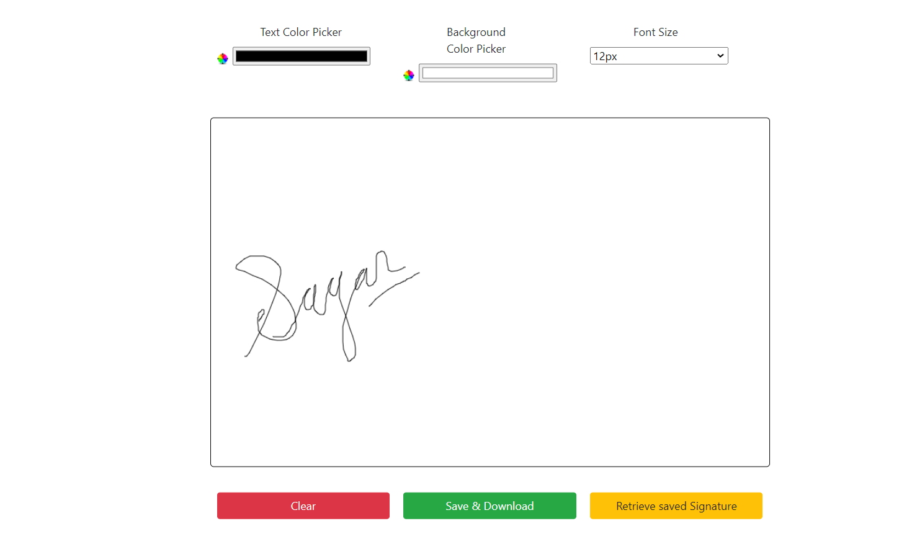

# ESignature Application



## Overview

The **ESignature Application** is a simple web-based tool that allows users to create, customize, and save digital signatures. The application is designed to be intuitive and user-friendly, providing a canvas for drawing signatures with options to change text color, background color, and font size. Users can save their signatures locally and retrieve them whenever needed.

## Features

- **Draw Digital Signatures**: Use the canvas to draw your signature with a mouse or touch screen.
- **Customize Signature Appearance**: Change the color of the text and the background of the signature canvas.
- **Adjustable Font Size**: Set the thickness of the drawn lines by selecting different font sizes.
- **Clear Canvas**: Easily clear the canvas to start a new signature.
- **Save & Download Signature**: Save the signature locally and download it as a PNG image.
- **Retrieve Saved Signatures**: Retrieve previously saved signatures from local storage.

## Technologies Used

- **HTML5**: Provides the structure for the application.
- **CSS3**: Styles the application for a clean and modern look.
- **JavaScript**: Implements the logic for drawing on the canvas, saving and retrieving signatures, and handling user interactions.
- **Bootstrap**: Utilized for responsive and easy-to-use buttons and input elements.

## Getting Started

To get a local copy up and running, follow these simple steps.

### Prerequisites

- A modern web browser (such as Chrome, Firefox, Safari, or Edge)

### Installation

1. **Clone the repository:**

   ```bash
   git clone https://github.com/keyurkadam/ESignature-Application.git
   
2. **Navigate to the project directory:**
    
   ```bash
   cd ESignature-Application

3. **Open the index.html file in your web browser:**

    ```bash
    open index.html
